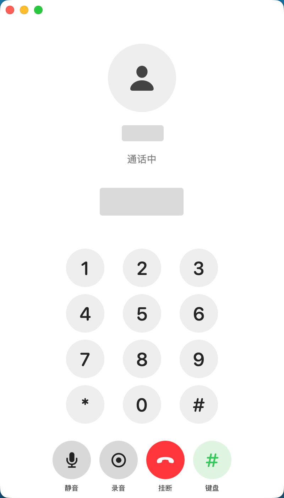

# DJOneHub

> 让大疆第一代 4G 模块成为 Mac 上长期可用的实体 SIM 终端。

DJOneHub 是一个非官方开源项目。它通过模块已有 USB 接口提供短信、4G、GPS、eSIM、来电及通话控制，不修改模块固件。

## v1.2.4：独立 App 版

从网页控制台整理为独立 macOS App。拨号、通话、短信、通讯录和设置都收进同一套界面；来电与短信提醒不需要网页常驻。

| 功能 | 说明 |
| --- | --- |
| 电话 | 拨号、接听、拒接、挂断、DTMF、通话记录和录音入口。 |
| 短信 | 收发短信、验证码预览；读取后可自动清理模块存储。 |
| 通讯录 | 可同步本机通讯录，用姓名或号码拨号、发短信。 |
| 网络与 GPS | USB 4G、Wi-Fi 优先、4G 兜底、GPS/GNSS 状态与菜单栏提示。 |
| 模块工具 | eUICC Profile、AT 调试、网络诊断和初始化状态。 |

## 界面预览

> 以下均为真实界面截图；号码、联系人、头像、验证码和时间已遮蔽。

### 电话

<p align="center">
  
  
  
</p>

拨号、接听、拒接、挂断、DTMF、通话记录与录音入口统一在电话页。

<p align="center">
  
  
</p>

### 短信与通讯录

<p align="center">
  
  
</p>

短信支持收发、验证码预览和自动清理；通讯录可同步本机联系人并用于检索。

<p align="center">
  
</p>

### 设置与版本

<p align="center">
  
</p>

## 下载与平台状态

| 平台 | 包 | 当前状态 |
| --- | --- | --- |
| macOS 13+ | `DJOneHub-macOS-universal-v1.2.4.dmg` | Apple Silicon 实机验证；包内含 arm64 + x86_64，Intel 尚未真机验证。 |
| Windows x86-64 | `DJOneHub-Windows-amd64-v1.2.4.zip` | 内含 `DJOneHub.exe`；尚未在真实 Windows + 模块上验证。 |

Windows 目前不承诺模块功能可用；它不提供 macOS 专用的 USB AT/eSIM、USB 4G 自动策略、原生通知、MapKit 或双向通话音频。

## macOS 安装

1. 打开 DMG，运行“安装 DJOneHub.command”。
2. 日常直接打开 DJOneHub App；也可在安装目录运行 `djonehub start`。

本地服务只监听 `127.0.0.1:7575`。首次通话时，App 会请求麦克风权限。

## 通话与开源边界

源码包含 macOS App、Go 后端、Windows 控制台、MaVo MIT 音频适配代码和构建脚本。

Mac 双向通话仍需要模块侧语音运行时。该运行时**不随本仓库、Release、DMG 或 Windows ZIP 提供**：其中两个内核模块当前没有可核对的对应源码或明确再分发依据。请不要把未知来源的二进制提交到 Issue、PR 或衍生 Release。

已合法获得兼容运行时的开发者，可按 [OPEN_SOURCE_SCOPE.md](OPEN_SOURCE_SCOPE.md) 的外置运行时约定自行研究。缺少运行时时，来电、通话状态和控制入口仍可使用，但 Mac 双向语音不会启用。

## 从源码构建

```sh
# macOS Universal
scripts/package-macos-universal.sh v1.2.4
scripts/build-dmg-universal.sh v1.2.4

# Windows x86-64
scripts/package-windows-amd64.sh v1.2.4
```

构建 macOS 包需要完整 Xcode、Go、`pkg-config` 与网络下载官方 libusb 源码。Windows 包在 Mac 上只能交叉编译，不能替代 Windows 真机验证。

## 使用提醒

- 使用蜂窝数据、短信、通话与 eSIM 前，请确认运营商协议、资费及当地法律要求。
- GPS 默认关闭；定位信息仅在本机读取和展示。
- 本项目不会上传 SIM、短信、联系人、录音或卡片资料。
- 与 DJI、Quectel、运营商及 eSIM 厂商不存在隶属或授权关系。

许可证与第三方声明见 [LICENSE](LICENSE)、[THIRD_PARTY_NOTICES.md](THIRD_PARTY_NOTICES.md) 与 [OPEN_SOURCE_SCOPE.md](OPEN_SOURCE_SCOPE.md)。
