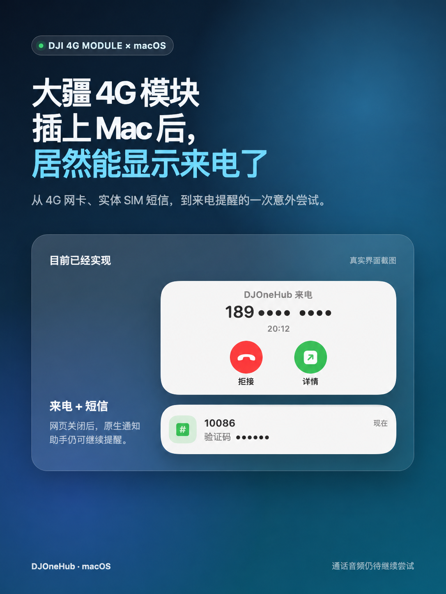

# DJOneHub

让大疆第一代 4G 模块成为 Mac 上可长期使用的实体 SIM 终端。

DJOneHub 是一个非官方开源项目。它通过模块已有的 USB 接口提供状态、短信、4G 网络、GPS、eSIM、来电与通话控制，不修改模块固件。

## 现在能做什么

- 实体 SIM 短信收发、验证码预览、本机号码读取
- 短信读取后自动清理模块存储，可在 App 内关闭
- USB 4G 上网；Wi-Fi 优先、4G 兜底
- 来电与短信原生风格提醒；网页关闭后提醒仍可工作
- 拨号、接听、拒接、挂断、DTMF、通话记录与通讯录
- GPS/GNSS 状态、菜单栏图标与地图浮窗
- 兼容实体 eUICC 的 Profile 管理、AT 调试与网络诊断
- 独立 macOS App：不需要把网页控制台一直开着



## 通话与开源边界

项目源码开源，包含 macOS App、Go 后端、Windows 控制台、MaVo MIT 音频适配代码和全部可构建脚本。

Mac 双向通话还需要模块侧语音运行时。该运行时**不随本仓库、Release、DMG 或 Windows ZIP 提供**：其中两个内核模块当前没有可核对的对应源码或明确再分发依据。请不要把未知来源的二进制提交到 Issue、PR 或衍生 Release。

已合法获得兼容运行时的开发者，可以按 [OPEN_SOURCE_SCOPE.md](OPEN_SOURCE_SCOPE.md) 的外置运行时约定自行放置并研究；缺少运行时时，来电、通话状态和控制入口仍可使用，但 Mac 双向语音不会启用。

## 下载与平台状态

| 平台 | 包 | 当前状态 |
| --- | --- | --- |
| macOS 13+ | `DJOneHub-macOS-universal-v1.2.4.zip` / DMG | Apple Silicon 实机验证；包内含 arm64 + x86_64，Intel 尚未真机验证。 |
| Windows amd64 | `DJOneHub-Windows-amd64-v1.2.4.zip` | `DJOneHub.exe` 可构建；尚未在真实 Windows + 模块上验证。 |

Windows 目前不承诺模块功能可用；它不提供 macOS 专用的 USB AT/eSIM、USB 4G 自动策略、原生通知、MapKit 或双向通话音频。

## macOS 安装

1. 完整解压 ZIP，或打开 DMG 后运行“安装 DJOneHub.command”。
2. 在解压目录运行：

   ```sh
   ./install
   ```

3. 日常使用直接打开 DJOneHub App；也可以执行：

   ```sh
   djonehub start
   ```

本地服务只监听 `127.0.0.1:7575`。首次通话时，App 会请求麦克风权限。

## 从源码构建

### macOS Universal

```sh
scripts/package-macos-universal.sh v1.2.4
scripts/build-dmg-universal.sh v1.2.4
```

### Windows amd64

```sh
scripts/package-windows-amd64.sh v1.2.4
```

构建 macOS 包需要 Xcode Command Line Tools、Go、`pkg-config` 与网络下载官方 libusb 源码。Windows 包在 Mac 上只能交叉编译，不能替代 Windows 真机验证。

## 使用提醒

- 使用蜂窝数据、短信、通话与 eSIM 前，请确认运营商协议、资费及当地法律要求。
- GPS 默认关闭；开启后仅在本机读取和展示定位信息。
- 本项目不会上传 SIM、短信、联系人、录音或卡片资料。
- 与 DJI、Quectel、运营商及 eSIM 厂商不存在隶属或授权关系。

许可证与第三方声明见 [LICENSE](LICENSE)、[THIRD_PARTY_NOTICES.md](THIRD_PARTY_NOTICES.md) 与 [OPEN_SOURCE_SCOPE.md](OPEN_SOURCE_SCOPE.md)。
